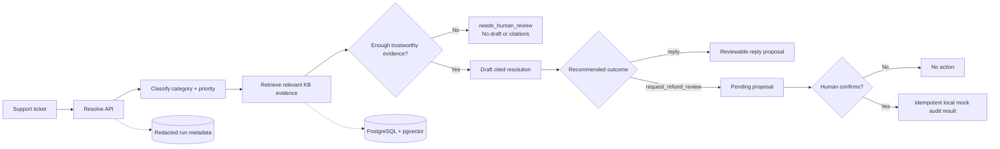

# AI Support Ticket Resolution Copilot

An evidence-backed support copilot that turns a messy customer ticket into a safe, reviewable resolution proposal.

**[Try the live demo →](https://ai-support-ticket-resolution.sidratsoft.me/)**

The application classifies synthetic support tickets, retrieves relevant knowledge-base evidence, drafts a cited reply, and abstains when the evidence is not strong enough. It keeps a human in control of every action: refund-related outcomes are proposals only and require explicit confirmation before creating an idempotent local mock audit record.

> This project uses synthetic data. It does not connect to a real help desk, send customer messages, issue refunds, or change payment/account state.

## What it demonstrates

- Schema-validated ticket classification and priority routing.
- Category-first PostgreSQL + pgvector retrieval with exact source citations.
- Grounded replies that can safely become `needs_human_review` when evidence is missing, ambiguous, contradictory, or unsupported.
- A separate confirmation boundary for `request_refund_review`, with signed-session ownership and idempotent mock execution.
- Versioned golden-dataset evaluations with retrieval, citation, abstention, latency, token, and error metrics.
- Redacted structured telemetry and optional metadata-only Langfuse tracing.
- A server-only V2 foundation for bounded, read-only investigation over five enumerated synthetic tools.

## How it works



The model proposes. Application code owns validation, retrieval, citation provenance, authorization, confirmation, persistence, and idempotency.

## Architecture

```text
src/
├── app/             # Next.js UI and Route Handlers
├── domain/          # Zod-backed application contracts
├── ai/              # Anthropic adapter, prompts, pipeline, grounding checks
├── embeddings/      # Voyage AI embedding contract and adapter
├── retrieval/       # pgvector search, thresholds, context construction
├── ingestion/       # Markdown parsing, chunking, hashing, persistence
├── actions/         # Validated local mock action boundary
├── evals/           # Golden dataset runner, graders, history, comparisons
├── investigation/   # Bounded V2 synthetic read-only tool foundation
├── db/              # Drizzle schema, migrations, and PostgreSQL access
├── auth/            # Anonymous signed HTTP-only sessions
└── observability/   # Redacted logs and optional OpenTelemetry tracing
```

Core technologies: Next.js App Router, TypeScript, Zod, PostgreSQL, pgvector, Drizzle ORM, Anthropic, Voyage AI, Vitest, Tailwind CSS, and Podman Compose.

## Run locally

### Prerequisites

- Node.js 24 LTS
- pnpm 11
- Podman with the `podman compose` provider
- Anthropic and Voyage AI API keys for live resolution, ingestion, and evaluation

### Setup

```bash
pnpm install
cp .env.example .env.local
```

Set `ANTHROPIC_API_KEY`, `LLM_MODEL`, `VOYAGE_API_KEY`, and a random `SESSION_COOKIE_SECRET` of at least 32 characters. The remaining local defaults are documented in `.env.example`.

Start PostgreSQL with pgvector, migrate the schema, and ingest the synthetic knowledge base:

```bash
podman compose up -d
pnpm db:migrate
pnpm ingest
```

Start the application:

```bash
pnpm dev
```

Open [http://localhost:3000](http://localhost:3000). A useful example ticket is:

> I upgraded yesterday, but I was charged for both plans.

The ingestion command is deterministic and idempotent: unchanged sources are skipped, while changed sources are re-embedded and replaced transactionally. Use `pnpm chunks:inspect` to inspect the persisted synthetic chunks without exposing vectors or internal database fields.

## Evaluation

The repository includes a committed `golden.v2` dataset with 36 synthetic cases covering normal, edge, adversarial, ambiguous, contradictory, action-ready, and unanswerable scenarios.

Run the shared evaluator with:

```bash
pnpm eval -- --concurrency=3 --output=artifacts/eval-results.json
```

The evaluator uses the same classification, retrieval, and resolution pipeline as the application. It records safe aggregate and per-case results, preserves dataset order, and gates on schema validity, category accuracy, retrieval recall, citation support, and abstention accuracy. It never stores ticket text, full prompts, drafts, provider payloads, vectors, or secrets.

For a local browser console, run `pnpm dev` with `ENABLE_LIVE_EVALUATIONS=true` and open [`/admin/evaluations`](http://localhost:3000/admin/evaluations). This is intentionally disabled in production and is not a production analytics dashboard.

## Trust and safety boundaries

- Anthropic is used for text generation; Voyage AI is used only for embeddings.
- Provider SDKs, database access, retrieval, authoritative validation, and telemetry writes stay server-side.
- Ticket text is not persisted or written to telemetry; successful runs retain a keyed ticket hash and safe run metadata.
- Every citation must belong to the current resolution run.
- Insufficient or unsupported evidence produces a controlled human-review outcome instead of an invented answer.
- Refund-review confirmation requires the owning signed session, exactly `{ "confirmed": true }`, and a stored pending proposal.
- Repeated or concurrent confirmations return the same stored result; no real refund or payment mutation occurs.
- The V2 investigation foundation is application-owned, read-only, enumerated, schema-validated, and budget-bounded. It is not a general-purpose autonomous agent.

## Useful commands

```bash
pnpm verify             # format, lint, typecheck, migration check, tests, build
pnpm test               # deterministic unit/integration-style tests
pnpm test:coverage      # coverage report
pnpm test:integration   # requires TEST_DATABASE_URL ending in _test
pnpm db:check           # verify migrations are consistent
pnpm db:migrate         # apply Drizzle migrations
pnpm ingest             # ingest synthetic Markdown knowledge
pnpm chunks:inspect     # inspect persisted chunks safely
pnpm eval -- --concurrency=3 --output=artifacts/eval-results.json
```

Unit tests are network-free. Live provider workflows are explicit and cost-bearing; they are not part of pull-request verification.

## Operations and deployment

- [First production deploy](docs/operations/first-production-deploy.md)
- [Dokploy deployment and rollback procedures](docs/operations/dokploy-deployment.md)
- [Langfuse observability guide](docs/operations/langfuse-observability.md)
- [Product requirements](docs/ai-support-copilot-prd.md)
- [Technical specification](docs/ai-support-copilot-technical-spec.md)

The production image runs as a non-root user, applies committed migrations, and ingests the version-controlled synthetic knowledge base before becoming healthy. CI verifies formatting, linting, types, migrations, tests, builds, container smoke behavior, dependency security, and CodeQL checks.

## Project boundaries

This is a focused resolution copilot, not a customer-support platform. It intentionally excludes accounts, multi-tenancy, billing, real help-desk integrations, customer messaging, real refunds, arbitrary uploads, model training, provider fallback, streaming chat history, and unbounded agent autonomy.
